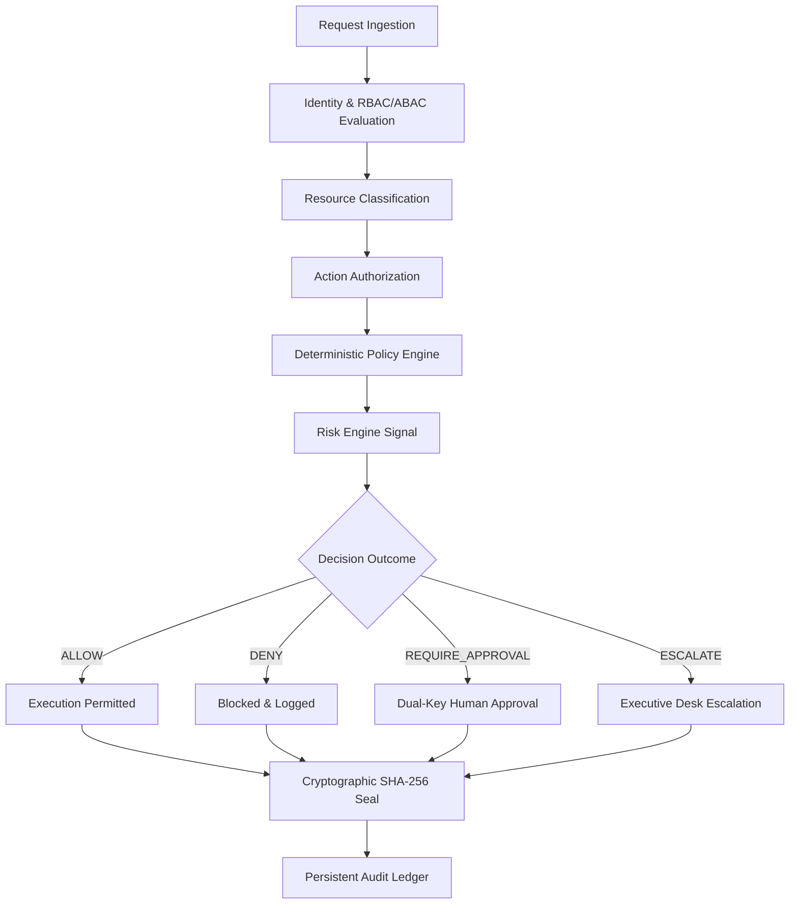

# Security Decision Provenance & Policy Boundary Enforcement

## Overview
The Security Decision Provenance Engine guarantees that no critical, destructive, or privileged operation within Sovereign OS, MTF, or ecosystem services can execute without an immutable, auditable decision artifact.

## Decision Pipeline Architecture

## Provenance Schema Fields
| Field | Type | Description |
| :--- | :--- | :--- |
| `decisionId` | `string` | Cryptographically unique decision identifier. |
| `correlationId` | `string` | Trace ID linking the decision to initial client request. |
| `actor` | `object` | Verified actor identity, roles, and authentication method. |
| `resource` | `string` | Target ecosystem asset identifier. |
| `action` | `string` | Requested operation. |
| `riskEvaluation` | `object` | Input risk score and classified risk tier (LOW, MEDIUM, HIGH, CRITICAL). |
| `policyEvaluation`| `object` | Matched policy rule and rule priority. |
| `decision` | `enum` | Outcome: `ALLOW`, `DENY`, `REQUIRE_APPROVAL`, `ESCALATE`. |
| `reasonCode` | `string` | Deterministic rationale explaining the policy verdict. |
| `approvalRequirements` | `object` | Mandatory dual approver roles if sensitive action. |
| `cryptographicSignature` | `string` | SHA-256 digest sealing canonical decision fields. |
